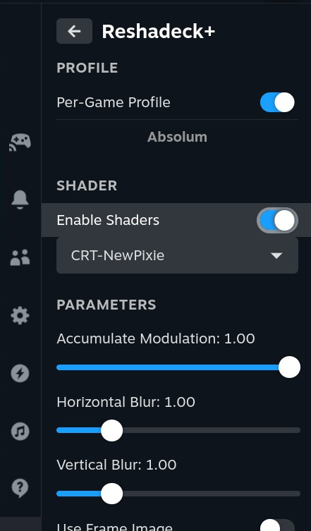

# Reshadeck+

This is a fork of a fork based on the work of [mspeedo/Reshadeck](https://github.com/mspeedo/Reshadeck) and originally [safijari/Reshadeck](https://github.com/safijari/Reshadeck).

It is hosted here: [https://github.com/jeanbottein/ReshadeckPlus](https://github.com/jeanbottein/ReshadeckPlus).

Reshade Shader Loader for Decky Plugin Loader for the handheld Steam Game Loader. It ships with a small curated set of shaders.
More shaders can be added at the `~/.local/share/gamescope/reshade/Shaders` folder such that the `.fx` files are in the 
root of the `Shaders` folder. Then you can pick and apply the shader using the plugin.

# Installation

1.  Download the plugin ZIP file from the [Releases](https://github.com/jeanbottein/ReshadeckPlus/releases/latest).
2.  Open Quick Access Menu (three dots button)
3.  Navigate to Decky → Settings (gear icon)
4.  Enable Developer Mode if not already enabled
5.  Click Install Plugin from ZIP
6.  Navigate to the downloaded ZIP file and select it
7.  The plugin will install automatically

# Caveats
- Shaders can caused dropped frames in some rare cases and could also lead to severe performance degradation
- Shaders will not be applied at startup
- Screenshots will not contain the shader (but videos recorded via Decky Recorder will)
- When in game, the QAM menu will not have the shader applied
- When not in a game, the whole OS will have the shader applied
- Not all features of reshade are supported
- Some shaders can cause the Deck to crash

# Crash Prevention
This plugin includes two mechanisms to prevent crash loops caused by bad shaders or configurations:

1.  **Immediate Crash Protection**: When you select a new shader or change parameters, the settings are not saved to disk for **5 seconds**. If your system crashes immediately (e.g., due to a bad shader), the plugin will revert to the previous safe configuration on reboot.
2.  **Persistent Crash Loop Detection**: If the plugin detects **2 consecutive system crashes** while it is enabled, it will automatically **disable itself** to ensure you can boot back into Gaming Mode safely. This protects against global shader crashing the system.

# A note on Deck OLED Fringing Patterns
The subpixel pattern of the Steam Deck OLED (Samsung screen at least), leads to some fringing that is visible to a small minority of people.
It is possible to [largely eliminate this fringing](https://gist.github.com/safijari/1b936cbbdebe341fbe340bcfecb04450) using a shader. That 
shader is included by default in this plugin.

# Places to find more shaders

https://github.com/Matsilagi/RSRetroArch/tree/main/Shaders

https://framedsc.com/ReshadeGuides/shaderscatalogue.htm
